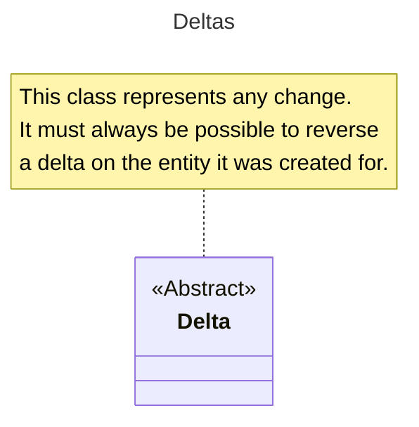

```mermaid
---
title: Deltas
---
classDiagram
    note for Delta "This class represents any change. <br>It must always be possible to reverse<br>a delta on the entity it was created for."
    class  Delta
    <<Abstract>> Delta
    class Delta{

    }
```