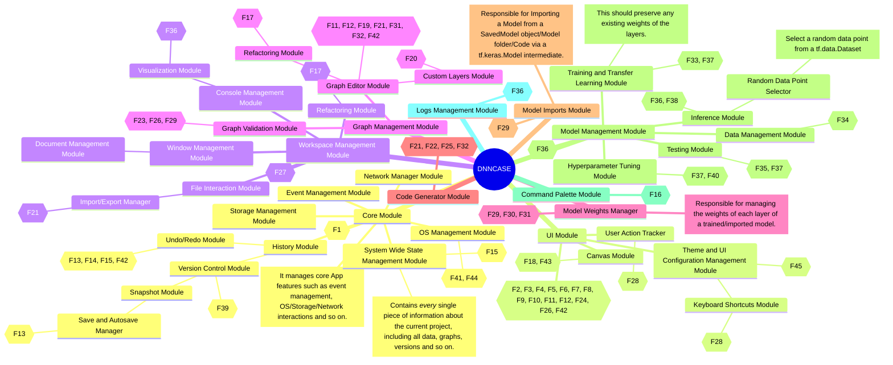
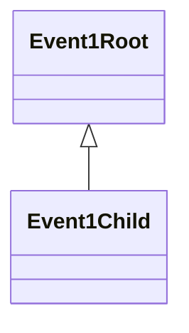

# Suggested Top Level Modules and Their Possible Events (Hierarchically Arranged)

## Contents

- [Suggested Top Level Modules and Their Possible Events (Hierarchically Arranged)](#suggested-top-level-modules-and-their-possible-events-hierarchically-arranged)
  - [Contents](#contents)
  - [Feature Requirements](#feature-requirements)
    - [Groupings as a Mindmap](#groupings-as-a-mindmap)
  - [Suggested Modules](#suggested-modules)
    - [Module 1](#module-1)
      - [Description](#description)
      - [Events](#events)
        - [Event 1 hierarchy root](#event-1-hierarchy-root)

## Feature Requirements

_Group these together to identify potential top level modules._

1. A desktop app that can run as a self contained system on any platform.
2. The application should have multiple toolbars.
3. One toolbar should contain the project name, app icon, close/minimize/maximize keys.
4. Another toolbar should contain the menus (`File`, `Edit`...). There should also be a `Help` menu, showing documentation links, and also updates if any.
5. A third toolbar should contain quick access options such as undo/redo and command palette.
6. Another toolbar should show the tabs currently open in the current workspace.
7. There should be a bottom bar showing warnings, errors, git pull/push status and output format (`.ipynb` or `.py`).
8. The main work area should display contents of the open file. In case the open file is a NN graph, it should show side bars for element selection (e.g., layer) and parameter selection (e.g., hyperparameters specification).
9. Users should be able to view and edit neural network graph diagrams.
10. As a future support, the users should be allowed to open their data as a preview.
11. To edit the graphs, users ahould be given a choice from all keras API objects, such as layers, activations, losses, etc.
12. Users should be able to edit the hyperparameters for each layer.
13. Users should be given the allowance to undo/redo their changes and autosave their work.
14. The undo/redo should be separate for each editable tab and each input box.
15. The undo/redo should be supported across sessions (say I make some change, and then later open the graph. I should still be allowed to undo my changes).
16. Users should be given a command palette input where they can enter some text to display all associated allowed actions (say I want to auto-format the graph. The command palette should suggest it to me when I enter 'format').
17. Users should be allowed to auto format their graphs i.e., refactor the way the graph is being displayed.
18. Users should be allowed to move various graph entities around on an 'infinite' canvas.
19. Whenever a user adds an edge (u, v), the nodes u and v should exist.
20. Users should be allowed to create custom layers for their projects. The code for the custom layers should be given by the user. Our system should just import the layer as a black box, along with relevent metadata, such as hyperparameters, layer name, input-output count and so on.
21. Users should be able to import other graphs in their current graph as a black-box (i.e., the imported graph won't be editable from current tab) and use it as many times as they wish. _Important: each use is an independent and deep copy, i.e., separate instantiation of the imported graph._
22. Users should be able to convert their graphs into python code (keras based). This should be supported both as a python project, and as a jupyter notebook.
23. Users should be able to have their graphs validated. This should be done to ensure there are no circular dependencies in their project, and also no cycles in their individual graphs, among other errors.
24. When a layer is hovered upon, users should get a docstring about that layer as a tooltip.
25. Users should be allowed to create a `SavedModel` object from within the app as well, so that they can just import it in their code, rather than use the python code files generated.
26. When users get their graphs validated, errors/warnings if any should be highlighted in the graph itself.
27. Users should be able to work on neural network projects. This means that multiple projects, each as a folder should be allowed to be opened in the system, BUT one at a time. This is similar to the `Open Folder...` functionality in VS Code.
28. Users should be provided with keyboard shortcuts, and as a future enhancement, these should be modifiable by the user, on a _per-action_ basis. Clearly, this means **every user-facing action that can be mimicked by the push of a button should also be allowed to have a registered keybinding**.
29. Users should be allowed to import a model from its python code or its saved format. This will **only** be allowed if the input (code or saved format) _can be converted to a `tf.keras.Model` object_. The loaded models will be automatically formatted according to the formatting rules.
30. In case the model is loaded from a saved instance, its layer-level weights should be preserved, unless the user wants them purged (If the user does want the weights to be deleted, only the architecture should be retained). In case the weights are to be preserved, user should be allowed to decide the same for each layer (i.e., layer level granularity, not graph level). The weights should be preserved by default.
31. Users should be allowed to reorganize the layers of a loaded neural network's graph, and pre-trained weights if any must be preserved across this reorganization.
32. The language the users use to specify a graph structure should contain the `reuse block`, `repeater`, `edge`s, and `layer`s, as previously decided. A layer can have multiple inputs and outputs. Therefore, if another graph is imported into the current graph, the imported graph will also be treated as a layer (which doesn't have any hyperparameters).
33. Users should be allowed to train their models from within the system itself. This means that wherever the weights were preserved, transfer learning should take place.
34. Users should be able to set up data pipelines from within the system. They should be allowed to access remote data repositories as needed via URLs, and all `tf.data`, which includes `tf.data.Dataset`, functionalities should be given to the user for such creation.
35. Users should be able to test their model from within the system.
36. As the training/testing takes place, users should be shown the graphs depicting various user-chosen metrics, along with variation of loss.
37. Users should have the option to stop training/testing whenever they wish.
38. Users should be allowed to run inference on specific input data points.
39. Users should be allowed to create a version controlled timeline of the neural net corresponsing to their project. This means if I train my model today, and re-train it tomorrow, I should have a snaphot of the model after both the training sessions.
40. Users should be allowed to perform hyperparameter tuning. This should be provided separate from the model testing and training, to ensure no compatibility issues with any relevant libraries arise.
41. Users should be allowed to decide which version of keras they'll use, in case there are major differences across upcoming and previous keras versions. (I.e., in case forward- or backward- compatibility is missing)
42. Users should be provided a clear screen option. This should clear the currently visible graph on the screen (i.e., in the current tab). However, users should have the option to undo this change.
43. Users should be allowed to zoom in or out of the workspace of the graph, as visible on the screen.
44. Users should be given an option to choose their python interpreter, and tensorflow version (in case there are more than one installed). Also, users should be allowed to choose what underlying hardware they will use, in case, say more than 1 GPUs are available, or where they want to store any downloaded data (if not in the project folder itself).
45. Users should be allowed to choose what theme they want (dark/light/etc...) via configurable files.

<!-- Add any new features here onwards -->

### Groupings as a Mindmap

## Suggested Modules

### Module 1

#### Description

#### Events

##### Event 1 hierarchy root

