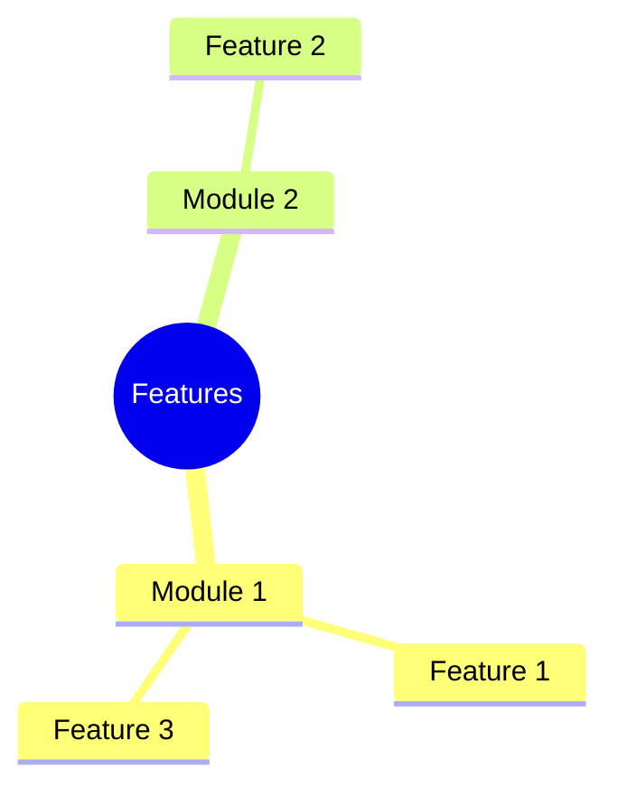
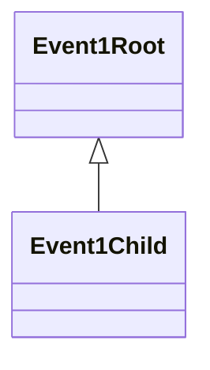

# Suggested Top Level Modules and Their Possible Events (Hierarchically Arranged)

## Contents

- [Suggested Top Level Modules and Their Possible Events (Hierarchically Arranged)](#suggested-top-level-modules-and-their-possible-events-hierarchically-arranged)
  - [Contents](#contents)
  - [Feature Requirements](#feature-requirements)
    - [Groupings as a Mindmap](#groupings-as-a-mindmap)
  - [Suggested Modules](#suggested-modules)
    - [Module 1](#module-1)
      - [Description](#description)
      - [Events](#events)
        - [Event 1 hierarchy root](#event-1-hierarchy-root)

## Feature Requirements

_Group these together to identify potential top level modules._

1. A desktop app that can run as a self contained system on any platform.
2. The application should have multiple toolbars.
3. One toolbar should contain the project name, app icon, close/minimize/maximize keys.
4. Another toolbar should contain the menus (`File`, `Edit`...).
5. A third toolbar should contain quick access options such as undo/redo and command pallette.
6. Another toolbar should show the tabs currently open in the current workspace.
7. There should be a bottom bar showing warnings, errors, git pull/push status and output format (`.ipynb` or `.py`).
8. The main work area should display contents of the open file. In case the open file is a NN graph, it should show side bars for element selection (e.g., layer) and parameter selection (e.g., hyperparameters specification).
9. Users should be able to view and edit neural network graph diagrams.
10. As a future support, the users should be allowed to open their data as a preview.
11. To edit the graphs, users ahould be given a choice from all keras API objects, such as layers, activations, losses, etc.
12. Users should be able to edit the hyperparameters for each layer.
13. Users should be given the allowance to undo/redo their changes and autosave their work.
14. The undo/redo should be separate for each editable tab and each input box.
15. The undo/redo should be supported across sessions (say I make some change, and then later open the graph. I should still be allowed to undo my changes).
16. Users should be given a command pallete input where they can enter some text to display all associated allowed actions (say I want to auto-format the graph. The command pallete should suggest it to me when I enter 'format').
17. Users should be allowed to auto format their graphs i.e., refactor the way the graph is being displayed.
18. Users should be allowed to move various graph entities around on an 'infinite' canvas.
19. Whenever a user adds an edge (u, v), the nodes u and v should exist.
20. Users should be able to import other graphs in their current graph as a black-box (i.e., the imported graph won't be editable from current tab) and use it as many times as they wish. _Important: each use is an independent and deep copy, i.e., separate instantiation of the imported graph._
21. Users should be able to convert their graphs into python code (keras based). This should be supported both as a python project, and as a jupyter notebook.
22. Users should be able to have their graphs validated. This should be done to ensure there are no circular dependencies in their project, and also no cycles in their individual graphs.
23. When a layer is hovered upon, users should get a docstring about that layer as a tooltip.
24. Users should be allowed to create a `SavedModel` object from within the app as well, so that they can just import it in their code, rather than use the python code files generated.
25. When users get their graphs validated, errors/warnings if any should be highlighted in the graph itself.
26. Users should be able to work on neural network projects. This means that multiple projects, each as a folder should be allowed to be opened in the system, BUT one at a time. This is similar to the `Open Folder...` functionality in VS Code.
27. Users should be provided with keyboard shortcuts, and as a future enhancement, these should be modifiable by the user, on a _per-action_ basis.
28. Users should be allowed to import a model from its python code or its saved format. This will **only** be allowed if the input (code or saved format) _can be converted to a `tf.keras.Model` object_.

### Groupings as a Mindmap

## Suggested Modules

### Module 1

#### Description

#### Events

##### Event 1 hierarchy root

