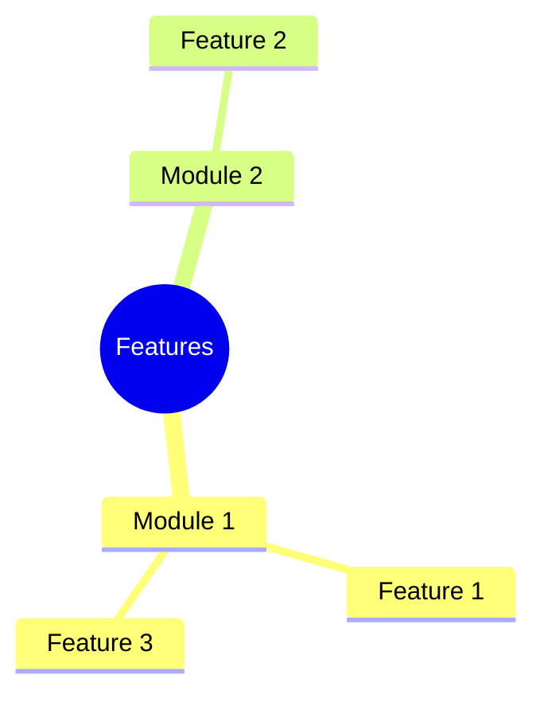
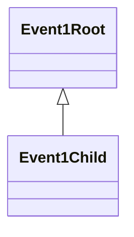

# Suggested Top Level Modules and Their Possible Events (Hierarchically Arranged)

## Contents

- [Suggested Top Level Modules and Their Possible Events (Hierarchically Arranged)](#suggested-top-level-modules-and-their-possible-events-hierarchically-arranged)
  - [Contents](#contents)
  - [Feature Requirements](#feature-requirements)
    - [Groupings as a Mindmap](#groupings-as-a-mindmap)
  - [Suggested Modules](#suggested-modules)
    - [Module 1](#module-1)
      - [Description](#description)
      - [Events](#events)
        - [Event 1 hierarchy root](#event-1-hierarchy-root)

## Feature Requirements

_Group these together to identify potential top level modules._

1. 

### Groupings as a Mindmap

## Suggested Modules

### Module 1

#### Description

#### Events

##### Event 1 hierarchy root

