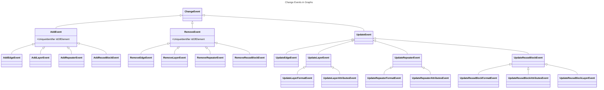

```mermaid
---
title: Change Events in Graphs
---
classDiagram
    ChangeEvent <|-- AddEvent
    ChangeEvent <|-- RemoveEvent
    ChangeEvent <|-- UpdateEvent

    AddEvent <|-- AddEdgeEvent
    AddEvent <|-- AddLayerEvent
    AddEvent <|-- AddRepeaterEvent
    AddEvent <|-- AddReuseBlockEvent

    RemoveEvent <|-- RemoveEdgeEvent
    RemoveEvent <|-- RemoveLayerEvent
    RemoveEvent <|-- RemoveRepeaterEvent
    RemoveEvent <|-- RemoveReuseBlockEvent

    UpdateEvent <|-- UpdateEdgeEvent
    UpdateEvent <|-- UpdateLayerEvent
    UpdateEvent <|-- UpdateRepeaterEvent
    UpdateEvent <|-- UpdateReuseBlockEvent

    UpdateLayerEvent <|-- UpdateLayerFormatEvent
    UpdateLayerEvent <|-- UpdateLayerAttributesEvent

    UpdateRepeaterEvent <|-- UpdateRepeaterFormatEvent
    UpdateRepeaterEvent <|-- UpdateRepeaterAttributesEvent

    UpdateReuseBlockEvent <|-- UpdateReuseBlockFormatEvent
    UpdateReuseBlockEvent <|-- UpdateReuseBlockAttributesEvent
    UpdateReuseBlockEvent <|-- UpdateReuseBlockLayerEvent

    class AddEvent{
        +UniqueIdentifier IdOfElement
    }
    class RemoveEvent{
        +UniqueIdentifier IdOfElement
    }
```
