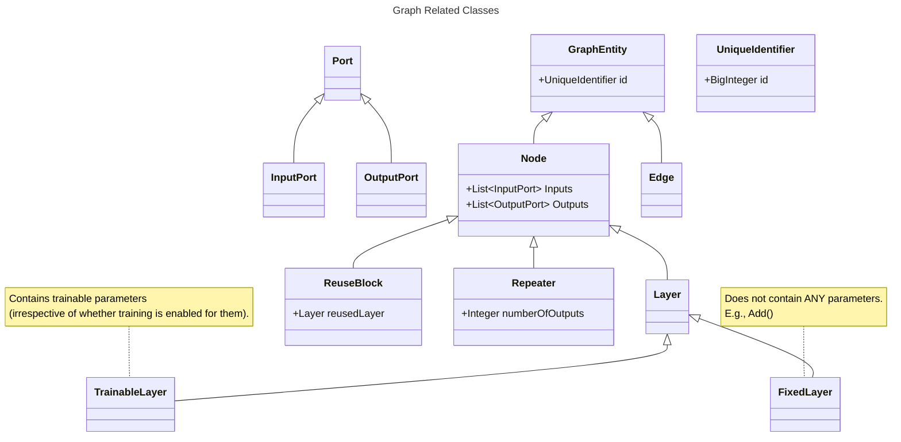

```mermaid
---
title: Graph Related Classes
---
classDiagram
    Port <|-- InputPort
    Port <|-- OutputPort

    GraphEntity <|-- Node
    GraphEntity <|-- Edge
    Node <|-- Layer
    Node <|-- ReuseBlock
    Node <|-- Repeater
    Layer <|-- TrainableLayer
    Layer <|-- FixedLayer
    note for TrainableLayer "Contains trainable parameters <br>(irrespective of whether training is enabled for them)."
    note for FixedLayer "Does not contain ANY parameters.<br>E.g., Add()"

    class UniqueIdentifier{
        +BigInteger id
    }
    class Port{

    }
    class InputPort{

    }
    class OutputPort{

    }

    class GraphEntity{
        +UniqueIdentifier id
    }
    class Node{
        +List~InputPort~ Inputs
        +List~OutputPort~ Outputs
    }
    class ReuseBlock{
        +Layer reusedLayer
    }
    class Repeater{
        +Integer numberOfOutputs
    }
```
