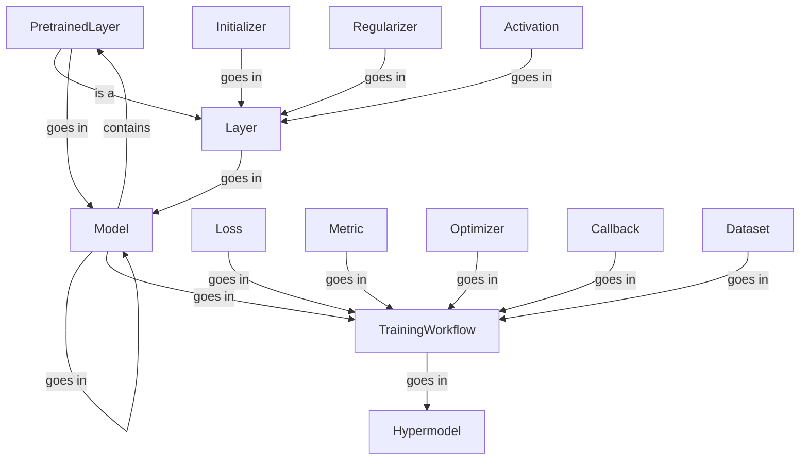

# Artifacts

## Contents

- [Artifacts](#artifacts)
  - [Contents](#contents)
  - [Basic Top-Level Flow](#basic-top-level-flow)

## Basic Top-Level Flow

```mermaid
flowchart TD
    PretrainedLayer --is a--> Layer
    PretrainedLayer --goes in--> Model
    Initializer --goes in--> Layer
    Regularizer --goes in--> Layer
    Activation --goes in--> Layer
    Layer --goes in--> Model
    Model --goes in--> Model
    Model --contains--> PretrainedLayer
    Loss --goes in--> TrainingWorkflow
    Metric --goes in--> TrainingWorkflow
    Optimizer --goes in--> TrainingWorkflow
    Callback --goes in--> TrainingWorkflow
    Model --goes in--> TrainingWorkflow
    Dataset --goes in--> TrainingWorkflow
    TrainingWorkflow --goes in--> Hypermodel
```